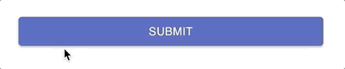
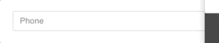
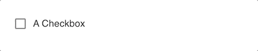
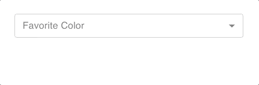

# material-ui-pack

[](https://badge.fury.io/js/material-ui-pack)
[](https://travis-ci.org/claytonfbell/material-ui-pack)

Why? Because I love the [Material UI](https://material-ui.com/) api but `<TextField name="phone" phone>` is nicer than `<TextField variant="outlined" size="medium" value={state.phone} label="Phone" onChange={handlePhoneFormatAndSetState}/>` when you manage a lot of forms and many projects.

## Install

```bash
npm i material-ui-pack

# install Material UI peer dependency
npm i @material-ui/core
```

## Form

Pass your own `state` and `setState` into the surrounding `Form` component.

| Property | Description                                                                   |
| -------- | ----------------------------------------------------------------------------- |
| state    | React useState to contain all your form values.                               |
| setState | From React useState                                                           |
| onSubmit | Callback function to fire when form is submitted                              |
| busy     | Boolean used to disable inputs and submit button after your form is submitted |
| margin   | Default for `TextField` components `"normal" | "none" | "dense"`              |
| size     | Default for `TextField` components `"small" | "medium"`                       |
| debug    | Display state values stringified                                              |

```tsx
import React from "react"
import { Form, SubmitButton, TextField } from "material-ui-pack"

export default function App() {
  const [state, setState] = React.useState({
    email: "",
    password: "",
  })
  const [busy, setBusy] = React.useState(false)
  function handleSubmit() {
    setBusy(true)
    // do something with state here
    ...
    setBusy(false)
  }
  return (
    <Form state={state} setState={setState} onSubmit={handleSubmit} busy={busy}>
      <TextField name="email" email />
      <TextField name="password" password />
      <SubmitButton>Submit</SubmitButton>
    </Form>
  )
}
```

### useForm Hook

You can optionally use this React hook to compose your own custom form components.

```tsx
import React from "react"
import { useForm } from "./FormProvider"

export default function CustomFormInput(props) {
  const { formProps, getValue, setValue } = useForm()
  return (
    <input
      type="text"
      disabled={formProps.busy}
      value={getValue(props.name)}
      onChange={e => setValue(props.name, e.currentTarget.value)}
    />
  )
}
```

### SubmitButton



No need to set `type="submit"` or an `onClick` action.

```tsx
<SubmitButton>Submit</SubmitButton>
```

### TextField



The wrapped `TextField` will default with `variant="outlined"` and you can skip properties such as `label`, `value`, and `onChange`. Labels are automtically derived from `lodash.startCase` so that `TextField` with `name="firstName"` will be labeled _First Name_.

| Property | Description                                                                                                                                                                                          |
| -------- | ---------------------------------------------------------------------------------------------------------------------------------------------------------------------------------------------------- |
| name     | String key name from your state object, can also be an object path like `address.street1` or `alternateEmails[0].email`. It uses [lodash](https://lodash.com/docs/) to get/set values in your state. |

```tsx
// labeled "First Name"
<TextField name="firstName" />

// supports object paths in the name (uses lodash.get() and lodash.set())
<TextField name="alternateEmails[0]" label="Alternate Email"/>
```

#### Boolean props

| Property    | Description                                                                                 |
| ----------- | ------------------------------------------------------------------------------------------- |
| email       | All lowercase formatting                                                                    |
| password    | Hidden text with toggle button to view                                                      |
| newPassword | Display warning if it is too short or does not contain upper, lower, and numeric characters |
| phone       | Standard 10 digit phone formatting                                                          |
| capitalize  | Auto capitcalize words                                                                      |

```tsx
<TextField name="email" email />
<TextField name="password" password />
<TextField name="newPassword" newPassword />
<TextField name="phone" phone />
<TextField name="capitalizedWords" capitalize />
```

### Checkbox



```tsx
// auto labeled "A Checkbox"
<Checkbox name="aCheckbox" />
```

### SelectCombo



A drop-down/input combo box. User can enter or select options.

| Property | Description                                     |
| -------- | ----------------------------------------------- |
| options  | Array of objects containing `value` and `label` |

```tsx
<SelectCombo
  options={[
    { value: "blue", label: "Blue" },
    { value: "red", label: "Red" },
  ]}
  name="favoriteColor"
/>
```

### SelectCountry

This component uses [i18n-iso-countries](https://www.npmjs.com/package/i18n-iso-countries) to build a full list of countries for your address forms. Values are set as [ISO 3166-1 alpha-3](https://en.wikipedia.org/wiki/ISO_3166-1_alpha-3)

```tsx
<SelectCountry name="yourCountry" />
```

### SelectRegion

This component uses [country-region-data](https://www.npmjs.com/package/country-region-data) to build a full list of states/provinces with the props value `country`.

```tsx
<SelectRegion country={state.yourCountry} name="stateOrProvince" />
```

### SelectTimeZone

This component uses [moment-timezone](https://momentjs.com/timezone/) to build a full list of time zones.

```tsx
<SelectTimeZone name="timeZone" />
<Select
    name="color"
    options={[
    { value: "blue", label: "Blue" },
    { value: "red", label: "Red" },
    ]}
/>
```

### Select

This is a simple native drop-down select component.

| Property | Description                                                                 |
| -------- | --------------------------------------------------------------------------- |
| options  | Array of objects containing `(string | numnber) value` and `(string) label` |

```tsx
<Select
  name="color"
  options={[
    { value: "blue", label: "Blue" },
    { value: "red", label: "Red" },
  ]}
/>
```

### RichTextEditor (markdown format)

This component uses [react-draft-wysiwyg](https://jpuri.github.io/react-draft-wysiwyg/) and sets value in markdown formatting.

```tsx
<RichTextEditor name="markdownContent" />
```

### TextEditor

This component provides user choice to toggle between a `RichTextEditor` or a normal multiline `TextField`.

```tsx
<TextEditor name="markdownContent" />
```

### DateTimePicker

This component uses [@material-ui/pickers](https://material-ui-pickers.dev/) and sets values in [ISO 8601](https://en.wikipedia.org/wiki/ISO_8601) format.

```tsx
<DateTimePicker name="dateAndTime" />
```

### DatePicker

This component uses [@material-ui/pickers](https://material-ui-pickers.dev/) and sets values in "yyyy-mm-dd" format.

```tsx
<DatePicker name="date" />
```

### TimePicker

This component uses [@material-ui/pickers](https://material-ui-pickers.dev/) and sets values in "hh:mm:ss" format.

```tsx
<TimePicker name="time" />
```
