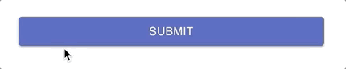
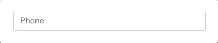
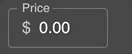
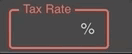
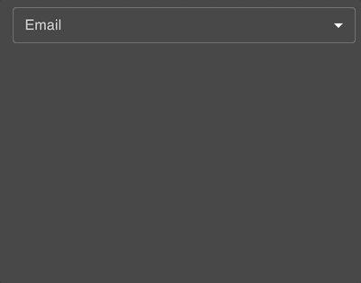
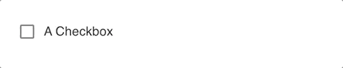
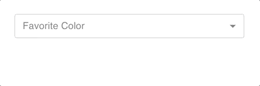
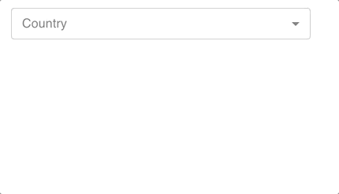
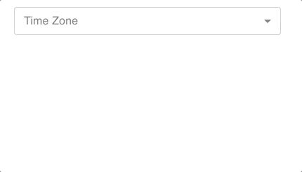
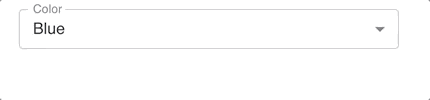

# material-ui-pack

[](https://badge.fury.io/js/material-ui-pack)
[](https://travis-ci.org/claytonfbell/material-ui-pack)

Why? Because I love the [Material UI](https://material-ui.com/) api but `<TextField name="phone" phone>` is nicer than `<TextField variant="outlined" size="medium" value={state.phone} label="Phone" onChange={handlePhoneFormatAndSetState}/>` when you manage a lot of forms and many projects.

<!-- toc -->

- [Install](#install)
- [Form](#form)
  - [useForm Hook](#useform-hook)
  - [SubmitButton](#submitbutton)
  - [TextField](#textfield)
  - [CurrencyField](#currencyfield)
  - [PercentageField](#percentagefield)
  - [EmailField](#emailfield)
  - [Checkbox](#checkbox)
  - [SelectCombo](#selectcombo)
  - [SelectCountry](#selectcountry)
  - [SelectRegion](#selectregion)
  - [SelectTimeZone](#selecttimezone)
  - [Select](#select)
  - [DateTimePicker](#datetimepicker)
  - [DatePicker](#datepicker)
  - [TimePicker](#timepicker)
  - [ResponsiveTable](#responsivetable)
- [Dark Mode](#dark-mode)
- [Date & Time Display](#date--time-display)
  - [DisplayDateTime](#displaydatetime)
  - [DisplayDate](#displaydate)
  - [formatDateTime](#formatdatetime)
  - [formatDate](#formatdate)
- [Hooks](#hooks)
  - [useCounter](#usecounter)
  - [useEscapeKey](#useescapekey)
  - [useHandleState](#usehandlestate)
  - [useStoredState](#usestoredstate)

<!-- tocstop -->

## Install

```bash
# npm
npm i material-ui-pack

# yarn
yarn add material-ui-pack
```

## Form

Pass your own `state` and `setState` into the surrounding `Form` component.

| Property | Description                                                                   |
| -------- | ----------------------------------------------------------------------------- |
| state    | React useState to contain all your form values.                               |
| setState | From React useState                                                           |
| onSubmit | Callback function to fire when form is submitted                              |
| busy     | Boolean used to disable inputs and submit button after your form is submitted |
| margin   | Default for `TextField` components `"normal" | "none" | "dense"`              |
| size     | Default for `TextField` components `"small" | "medium"`                       |
| debug    | Display state values stringified                                              |

```tsx
import React from "react"
import { Form, SubmitButton, TextField } from "material-ui-pack"

export default function App() {
  const [state, setState] = React.useState({
    email: "",
    password: "",
  })
  const [busy, setBusy] = React.useState(false)
  function handleSubmit() {
    setBusy(true)
    // do something with state here
    ...
    setBusy(false)
  }
  return (
    <Form state={state} setState={setState} onSubmit={handleSubmit} busy={busy}>
      <TextField name="email" type="email" />
      <TextField name="password" fomatter="password" />
      <SubmitButton>Submit</SubmitButton>
    </Form>
  )
}
```

### useForm Hook

You can optionally use this React hook to compose your own custom form components.

```tsx
import React from "react"
import { useForm } from "./FormProvider"

export function CustomFormInput(props) {
  const { formProps, getValue, setValue } = useForm()
  return (
    <input
      type="text"
      disabled={formProps.busy}
      value={getValue(props.name)}
      onChange={e => setValue(props.name, e.currentTarget.value)}
    />
  )
}
```

### SubmitButton



No need to set `type="submit"` or an `onClick` action.

```tsx
<SubmitButton>Submit</SubmitButton>
```

### TextField



The wrapped `TextField` will default with `variant="outlined"` and you can skip properties such as `label`, `value`, and `onChange`. Labels are automtically derived from the name property `name="firstName"` will be labeled _First Name_.

| Property    | Description                                                                                                                                                                                          |
| ----------- | ---------------------------------------------------------------------------------------------------------------------------------------------------------------------------------------------------- |
| name        | String key name from your state object, can also be an object path like `address.street1` or `alternateEmails[0].email`. It uses [lodash](https://lodash.com/docs/) to get/set values in your state. |
| lowercase   | All lowercase formatting                                                                                                                                                                             |
| password    | Hidden text with toggle button to view                                                                                                                                                               |
| newPassword | Display warning if it is too short or does not contain upper, lower, and numeric characters                                                                                                          |
| phone       | Standard 10 digit phone formatting                                                                                                                                                                   |
| capitalize  | Auto capitcalize words                                                                                                                                                                               |

```tsx
// labeled "First Name"
<TextField name="firstName" />

// supports object paths in the name (uses lodash.get() and lodash.set())
<TextField name="alternateEmails[0]" label="Alternate Email"/>

<TextField name="email" formatter="lowercase" />
<TextField name="password" formatter="password" />
<TextField name="newPassword" formatter="newPassword" />
<TextField name="phone" formatter="phone" />
<TextField name="capitalizedWords" formatter="capitalize" />
```

### CurrencyField



```tsx
<CurrencyField name="price" />
```

### PercentageField



```tsx
<PercentageField name="taxRate" decimals={3} />
```

### EmailField



Contains an auto-complete with popular mail servers.

```tsx
<EmailField name="email" />
```

### Checkbox



```tsx
// auto labeled "A Checkbox"
<Checkbox name="aCheckbox" />
```

### SelectCombo



A drop-down/input combo box. User can enter or select options.

| Property | Description                                     |
| -------- | ----------------------------------------------- |
| options  | Array of objects containing `value` and `label` |

```tsx
<SelectCombo
  options={[
    { value: "blue", label: "Blue" },
    { value: "red", label: "Red" },
  ]}
  name="favoriteColor"
/>
```

### SelectCountry



This component uses [i18n-iso-countries](https://www.npmjs.com/package/i18n-iso-countries) to build a full list of countries for your address forms. Values are set as [ISO 3166-1 alpha-3](https://en.wikipedia.org/wiki/ISO_3166-1_alpha-3), but support `alpha-2` also.

| Property | Description                 |
| -------- | --------------------------- |
| isoType  | `"isoAlpha2" | "isoAlpha3"` |

```tsx
<SelectCountry name="country" />
```

### SelectRegion


This component uses [country-region-data](https://www.npmjs.com/package/country-region-data) to build a full list of states/provinces with the props value `country`.

| Property       | Description                          |
| -------------- | ------------------------------------ |
| country        | To control which regions are loaded. |
| countryIsoType | `"isoAlpha3" | "isoAlpha2"`          |

```tsx
<SelectRegion country="USA" name="stateOrProvince" />
```

### SelectTimeZone



This component uses [moment-timezone](https://momentjs.com/timezone/) to build a full list of time zones.

| Property       | Description                    |
| -------------- | ------------------------------ |
| country        | To optionall filter the zones. |
| countryIsoType | `"isoAlpha3" | "isoAlpha2"`    |

```tsx
<SelectTimeZone name="timeZone" />
```

### Select



This is a simple native drop-down select component.

| Property | Description                                                               |
| -------- | ------------------------------------------------------------------------- |
| options  | Array of objects containing `(string | numnber) value`and`(string) label` |

```tsx
<Select
  name="color"
  options={[
    { value: "blue", label: "Blue" },
    { value: "red", label: "Red" },
  ]}
/>
```

### DateTimePicker


This component uses [@material-ui/pickers](https://material-ui-pickers.dev/) and sets values in [ISO 8601](https://en.wikipedia.org/wiki/ISO_8601) format.

```tsx
<DateTimePicker name="dateAndTime" />
```

### DatePicker

This component uses [@material-ui/pickers](https://material-ui-pickers.dev/) and sets values in "yyyy-mm-dd" format.

```tsx
<DatePicker name="date" />
```

### TimePicker

This component uses [@material-ui/pickers](https://material-ui-pickers.dev/) and sets values in "hh:mm:ss" format.

```tsx
<TimePicker name="time" />
```

### ResponsiveTable

```tsx
import React from "react"
import { ResponsiveTable } from "material-ui-pack"

export function ResponsiveTableExample() {
  return (
    <ResponsiveTable
      onSelectChange={film => {
        console.log(film)
      }}
      onEdit={film => alert(`Edit ${film.title}`)}
      onDelete={film => alert(`Delete ${film.title}`)}
      rowData={[
        { id: 1, title: "Star Wars", category: "Sci-Fi" },
        { id: 2, title: "The Shining", category: "Horror" },
      ]}
      schema={[
        {
          label: "Title",
          render: function(item) {
            return item.title
          },
        },
        {
          xsDownHidden: true,
          label: "Category",
          render: function(item) {
            return item.category
          },
        },
      ]}
    />
  )
}
```

## Dark Mode


Allow `useDarkMode` and `DarkModeProvider` to manage dark mode state. User can select dark mode in their operating system OR using the `DarkModeToggle` switch component. It sets a storage property to remember the user's preference.

```tsx
import React from "react"
import { ThemeProvider, CssBaseline } from "@material-ui/core"
import { useDarkMode, DarkModeProvider } from "material-ui-pack/dist/DarkModeProvider"
import DarkModeToggle from "material-ui-pack/dist/DarkModeToggle"

function ThemedContent() {
  const { createMuiThemeWithDarkMode } = useDarkMode()
  const theme = createMuiThemeWithDarkMode({
    palette: {
      primary: {
        main: "#db544c",
      },
    },
  })
  return (
    <ThemeProvider theme={theme}>
      <CssBaseline />
      <DarkModeToggle />
    </ThemeProvider>
  )
}

export default function App() {
  return (
    <DarkModeProvider>
      <ThemedContent />
    </DarkModeProvider>
  )

```

## Date & Time Display

### DisplayDateTime

```tsx
<DisplayDateTime
  iso8601="2020-02-21T06:15:06.149Z"
  timeZone="America/New_York"
  fromNow
/>
```

### DisplayDate

```tsx
<DisplayDate ymd="1978-09-22" fromNow />
```

### formatDateTime

```ts
formatDateTime("2020-02-21T06:15:06.149Z", "America/Chicago")
```

### formatDate

```ts
formatDate("1978-09-22")
```

## Hooks

### useCounter

```tsx
import IconButton from "@material-ui/core/IconButton"
import Add from "@material-ui/icons/Add"
import Remove from "@material-ui/icons/Remove"
import React from "react"
import useCounter from "../hooks/useCounter"

export function UseCounterExample() {
  const [count, increase, decrease] = useCounter(100)
  return (
    <>
      {count}
      <IconButton onClick={increase}>
        <Add />
      </IconButton>
      <IconButton onClick={decrease}>
        <Remove />
      </IconButton>
    </>
  )
}
```

### useEscapeKey

```tsx
import { Collapse } from "@material-ui/core"
import React from "react"
import useEscapeKey from "../hooks/useEscapeKey"

export function UseEscapeKeyExample() {
  const [isOpen, setIsOpen] = React.useState(true)

  useEscapeKey(
    React.useCallback(() => {
      setIsOpen(false)
    }, [])
  )

  return (
    <Collapse in={isOpen}>
      <h1>ESC to hide this</h1>
    </Collapse>
  )
}
```

### useHandleState

```tsx
import { Button, Collapse } from "@material-ui/core"
import React from "react"
import useHandleState from "../hooks/useHandleState"

export function UseHandleStateExample() {
  const [isOpen, handleIsOpen, setIsOpen] = useHandleState(true)

  return (
    <Collapse in={isOpen}>
      <Button onClick={() => setIsOpen(false)}>Hide with Setter</Button>
      <Button onClick={handleIsOpen(false)}>Hide with Handler</Button>
    </Collapse>
  )
}
```

### useStoredState

```tsx
import React from "react"
import Form from "../Form"
import useStoredState from "../hooks/useStoredState"
import TextField from "../TextField"

export function UseStoredStateExample() {
  const [state, setState] = useStoredState("myValues", {
    myText: "",
    myDescrption: "",
  })
  return (
    <Form state={state} setState={setState} margin="normal">
      <TextField name="myText" />
      <TextField name="myDescription" />
    </Form>
  )
}
```
